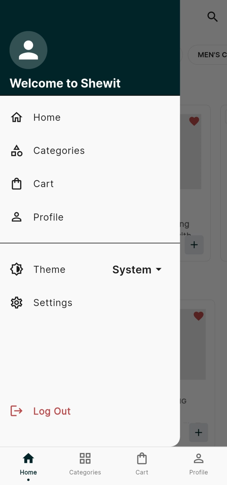
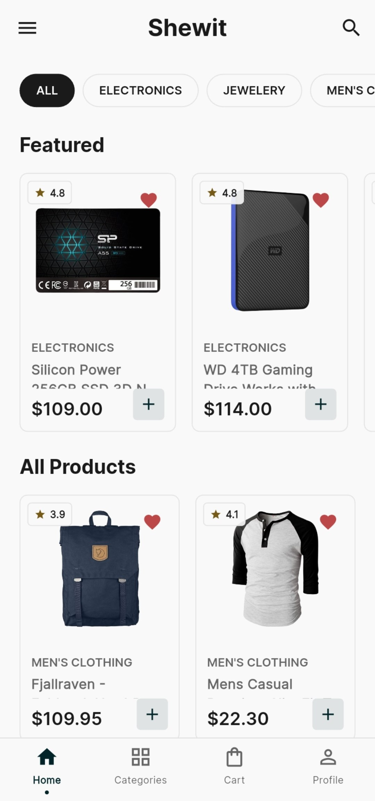
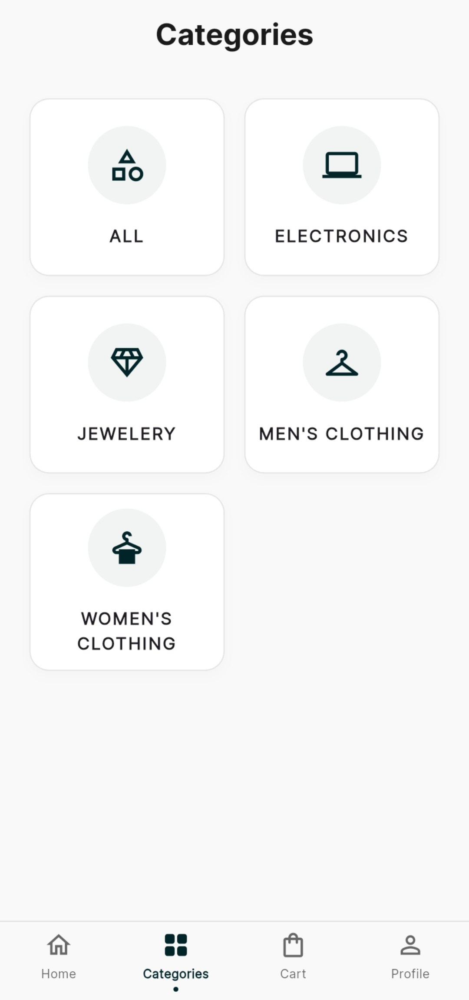

# Shewit 🛍️

**Shewit** is a modern, cross-platform mobile and web e-commerce application built with **Flutter**. It features a clean feature-first architecture, robust state management, and localized data management built to deliver a seamless shopping experience.

---

## 📸 App Previews

<table>
  <tr>
    <td align="center"><b>Home / Feed</b></td>
    <td align="center"><b>Categories / Search</b></td>
    <td align="center"><b>Product Details</b></td>
  </tr>
  <tr>
    <td></td>
    <td></td>
    <td></td>
  </tr>
</table>
</div>

 

## Features

* **Authentication Module:** Secure user sign-in, login screens, splash flow, and session state management.
* **Product Catalog & Discovery:** Browse products dynamically, view detailed descriptions, filter by categories, and examine rating metrics.
* **Cart & Checkout Workflow:** Full shopping cart capabilities alongside an integrated checkout procedure.
* **Wishlist & Favorites:** Save preferred products for quick access later.
* **User Profile & Settings:** Manage personal configurations, profile data, and preferences.
* **Responsive Multi-Platform Support:** Fully optimized to run natively across Android, iOS, Web, macOS, Linux, and Windows.


---

## Project Structure

```text
Shewit/
├── app/
│   ├── lib/
│   │   ├── core/
│   │   ├── features/
│   │   ├── shared/ 
│   │   └── main.dart
│   ├── assets/             
│   ├── android/
│   ├── ios/
│   ├── web/
│   ├── windows/
│   ├── macos/
│   ├── linux/               
│   └── pubspec.yaml        
├── screenshots/          
└── README.md
```

---

## Getting Started

1. **Clone the repository:**
   ```bash
   git clone https://github.com/Aaron-pweb/Shewit.git
   cd Shewit/app
   ```
2. **Install dependencies:**
   ```bash
   flutter pub get
   ```
3. **Run the app:**
   ```bash
   flutter run
   ```
